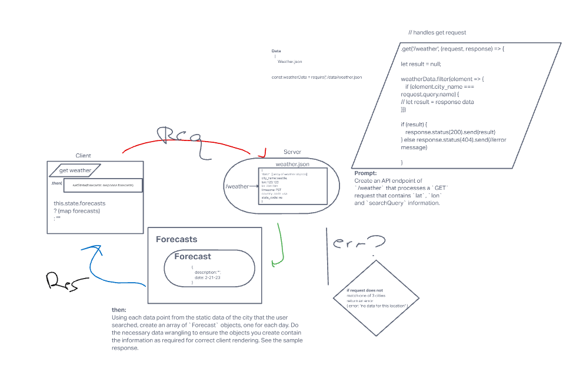
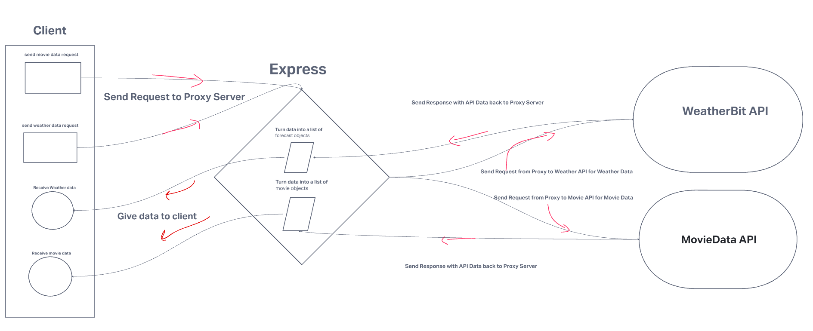

# City Explorer API

**Author**: Ethan Storm
**Version**: 1.0.0

## Overview

backend server for code 301 city explorer "Frolic through cities built to manage calls to other APIs that the user makes

## Getting Started

Clone repo and run `npm i`, then `npm run start-dev` to start express server. Install nodemon as a _dev dependency_ for ease of access Make sure to have this running on a **different** port than the front end

## Architecture

This application uses an express server and cors to manage requests from the front end and send data back

## Change Log

- 02-21-2023 11:30am - initial commit of unchanged express template

- 02-21-2023 5:04pm - finished adding requests to mock weather api to back and front end

- 02-21-2023 10:00am - branched for refactoring weather api and adding move API
- 02-21-2023 10:50am - added weather route and refactored to include real api
- 02-21-2023 12:25am - almost finished implementing new movie api
- 02-21-2023 2:45pm - adds successful movie api queries to client
- 02-21-2023 4:20pm - adds support for when request limit is reached
- 02-21-2023 4:26pm - adds start script
- 02-21-2023 5:45pm - finished deployment

- 02-22-2023 7:50am - branched for refactoring
- 02-22-2023 8:15am - commented code and refactored
- 02-23-2023 9:58am - fixes weather request, providing multiple forecasts
- 02-23-2023 10:05am - adds weekday date to weather component
- 02-23-2023 11:57am - adds lib folder to better organize modules
- 02-23-2023 4:44pm - fixes dateDay for forecasts

## Credit and Collaborations

Day 2 and 3 Code review and whiteboard with:

- [Kawika Miller](https://github.com/KMArtwork)

